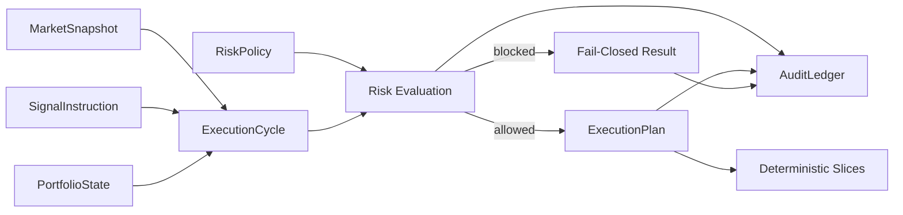

# Deterministic Execution Infrastructure

Architecture sample for deterministic execution infrastructure: risk-gated decision flow, deterministic order planning, audit-safe runtime boundaries, and observable execution control.

This repository is a compact portfolio project, not a production trading system. It shows a small execution runtime where state, risk checks, execution planning, and audit evidence are kept as separate, testable boundaries.

## What This Demonstrates

- Deterministic execution-cycle orchestration.
- Risk-first admission before any execution plan is produced.
- Stable order slicing with deterministic `client_order_id` generation.
- Append-only audit events with SHA-256 hash-chain integrity.
- Small, testable boundaries for market input, signal intent, portfolio state, risk policy, and execution planning.
- Portfolio-safe code that avoids secrets, broker integrations, and proprietary strategy rules.

## Architecture



The runtime shape is small:

1. Receive a `MarketSnapshot`.
2. Receive a `SignalInstruction`.
3. Read current `PortfolioState`.
4. Evaluate `RiskPolicy`.
5. Produce an `ExecutionPlan` only when risk allows it.
6. Write structured audit events.
7. Return a deterministic `CycleResult` envelope.

## Repository Layout

```text
execution_infrastructure/
  __init__.py
  audit_ledger.py
  execution_cycle.py
  execution_plan.py
  market_state.py
  risk_policy.py

examples/
  run_execution_cycle.py

tests/
  test_audit_ledger.py
  test_execution_cycle.py
  test_execution_plan.py
  test_risk_policy.py

architecture/
  deterministic-cycle.md
  safety-boundaries.md
```

## Run The Example

```bash
python3 examples/run_execution_cycle.py
```

Trimmed example output:

```json
{
  "run_id": "portfolio-demo-001",
  "risk": {
    "allowed": true,
    "reason": "allowed"
  },
  "execution_plan": {
    "signal_id": "sig-20260518-001",
    "symbol": "ES",
    "direction": "LONG",
    "total_quantity": 7,
    "slices": [
      {
        "client_order_id": "coid-00e94013682ccf79",
        "quantity": 5,
        "order_type": "IOC",
        "sequence": 1
      },
      {
        "client_order_id": "coid-0516624b1c539339",
        "quantity": 2,
        "order_type": "IOC",
        "sequence": 2
      }
    ]
  }
}
```

## Run Tests

```bash
python3 -m pytest
```

Requires Python 3.10 or newer.

The tests cover the main contract:

- low-confidence signals fail closed;
- exposure and open-position caps block execution;
- order slicing is deterministic;
- audit-chain verification detects tampering;
- blocked cycles never produce an execution plan.

## Non-Goals

This repository does not include:

- real broker connectivity;
- proprietary trading strategy logic;
- live market-data credentials;
- autonomous production execution;
- private model artifacts;
- customer, vendor, or account-specific data.

## Design Principles

- Make decision order explicit.
- Treat model output as input to a controlled runtime, not as authority.
- Keep risk and execution boundaries separate.
- Generate deterministic execution identifiers.
- Persist structured evidence for every material decision.
- Fail closed when a required safety condition is not met.

## Commercial production version

This repository is a public architecture sample only.

The full production implementation, Quant Deterministic Execution Engine
(QDE), is a separate proprietary commercial system available under a
per-instrument exclusive commercial license. Private source-code review
and technical due diligence are available under NDA.

The public sample does not include broker integrations, proprietary
strategy logic, private model artifacts, credentials, or production
deployment materials.

Contact: stefanlen@qde-systems.com

## Author

Stefan Len
