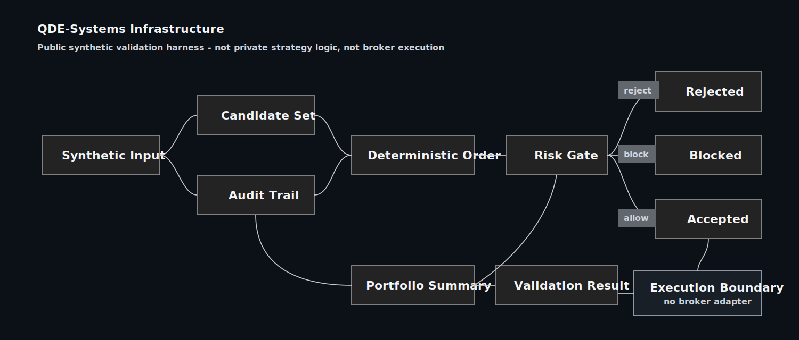

<p align="center">
  
</p>

<p align="center">
  
  
  
  
  
</p>

# QDE-Systems Infrastructure

Public infrastructure reference for QDE-Systems.

This repository is not the private QDE-Systems-ES source tree and it is not a
strategy leak. It is a small public harness that shows how I think about
deterministic research infrastructure: clear input contracts, no-lookahead
checks, candidate gates, portfolio-level summary, and an audit trail that can be
reviewed after the run.

The sample is intentionally synthetic. It uses QDE-style names and structure,
but it does not contain private setup-family logic, real historical data,
broker integration, Topstep account detail, or performance claims.

## What This Repository Shows

| Public layer | What the sample demonstrates | What stays private |
| --- | --- | --- |
| Synthetic research input | A named input profile for a synthetic ES research run | Real market data and private data packages |
| Validation candidate | Candidate records with provenance, side, family id, and deterministic ordering | Private setup-family rules and thresholds |
| Validation pipeline | Fixed validation order: provenance, no-lookahead, material validation, public gate | The commercial QDE strategy engine |
| Portfolio summary | A compact count-based scorecard shape | Real portfolio results or performance proof |
| Execution boundary summary | A visible boundary after accepted candidates pass the public risk gate | Broker execution and live order routing |
| Audit trail | Hash-linked audit events for later review | Production logs, broker state, credentials, or buyer material |

The point is not to show a trading strategy.

The point is to show the shape of a QDE-Systems infrastructure boundary:
deterministic input, explicit validation, a visible risk gate, reviewable
reasons, and no silent promotion from research candidate to execution boundary.

## Architecture

<p align="center">
  
</p>

The public flow is small:

1. Build a synthetic research input.
2. Feed synthetic validation candidates into the pipeline.
3. Sort them deterministically.
4. Apply public-safe validation gates.
5. Pass accepted candidates through a public risk gate boundary.
6. Keep the execution boundary visible without including broker execution.
7. Build a count-based portfolio summary.
8. Record every material step in the audit trail.
9. Return a public validation result.

The public gate score is illustrative for the harness, not a production policy
value.

## Repository Layout

```text
qde_systems_infrastructure/
  __init__.py
  audit_trail.py
  models.py
  portfolio_scorecard.py
  validation_pipeline.py

examples/
  run_qde_systems_validation.py

tests/
  test_audit_trail.py
  test_deterministic_output.py
  test_qde_public_validation.py

architecture/
  public-boundary.md
  qde-systems-infrastructure-flow-v2.svg
```

## Run The Public Validation Harness

```bash
python3 examples/run_qde_systems_validation.py
```

Trimmed example output:

```json
{
  "run_id": "qde-systems-public-validation-001",
  "system": "QDE-Systems Infrastructure",
  "validation_profile": "synthetic_qde_es_research_flow",
  "instrument_focus": "ES",
  "candidate_count": 4,
  "accepted_count": 1,
  "rejected_count": 2,
  "blocked_count": 1,
  "risk_gate_status": "qde_public_risk_gate_passed_for_accepted_candidates",
  "execution_boundary": "review_only_no_broker_adapter",
  "broker_execution_included": false,
  "audit_event_count": 9,
  "deterministic_output": true,
  "result_id": "qde-result-2f9ff00a407380a4"
}
```

## Run Tests

```bash
python3 -m pytest
```

The tests cover the public contract:

- same candidates in different input order produce the same result id;
- missing provenance is rejected;
- no-lookahead failure is rejected;
- missing material validation is blocked;
- low public gate score is rejected;
- audit events verify through the hash chain.

## What This Is Not

This repository is not:

- the private `QDE-Systems-ES` source repo;
- a trading strategy;
- a backtest result;
- a signal service;
- financial advice;
- a broker connector;
- a Topstep compliance proof;
- a performance or profit claim;
- a LIVE-ready trading system.

It does not include private family logic, detector thresholds, live account
state, broker adapter implementation, credentials, private market-data
configuration, or commercial QDE source code.

## Public Boundary

The public harness uses synthetic records so the infrastructure shape can be
inspected without exposing the private system.

The naming is QDE-specific on purpose. Generic examples hide the real design
question. QDE-Systems is about research and execution infrastructure where a
candidate has to pass explicit gates before it can become accepted output.

See [Public Boundary](architecture/public-boundary.md) for the disclosure
boundary behind this repository.

## Repository Name

This repository is published as `qde-systems-infrastructure`. It is the public
technical reference repository for the QDE-Systems infrastructure boundary:
synthetic QDE-style candidates, deterministic validation, count-based portfolio
summary, and reviewable audit evidence.

Brand identity notice: see [NOTICE](NOTICE).

## Official Links

- GitHub: [Stefan-Len](https://github.com/Stefan-Len)
- LinkedIn: [Stefan Len](https://www.linkedin.com/in/stefan-len-963813362/)
- X: [@StefanLenQDE](https://x.com/StefanLenQDE)
- Email: stefanlen@qde-systems.com

## Author

Štefan Lengyel, trading as Stefan Len / QDE-Systems
