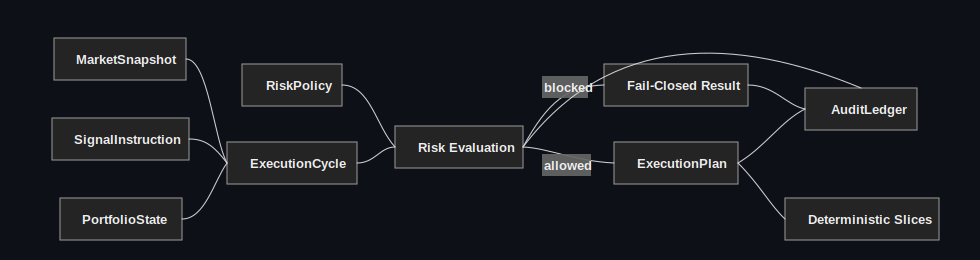

<p align="center">
  
</p>

# Quant Deterministic Execution Infrastructure

Architecture sample for deterministic execution infrastructure: risk-gated decision flow, deterministic order planning, audit-safe runtime boundaries, and observable execution control.

This repository is a compact portfolio project, not a production trading system. It shows a small execution runtime where state, risk checks, execution planning, and audit evidence are kept as separate, testable boundaries.

## What This Demonstrates

This public sample is intentionally small. It shows the engineering discipline behind deterministic execution infrastructure without exposing a commercial system.

It demonstrates:

- Risk admission before execution planning.
- Deterministic execution-cycle orchestration.
- Stable order slicing with deterministic `client_order_id` generation.
- Blocked execution paths that produce no execution plan.
- Append-only audit events with SHA-256 hash-chain integrity.
- Small, testable boundaries for market input, signal intent, portfolio state, risk policy, and execution planning.
- Tests that verify critical behavior.
- Portfolio-safe code that avoids secrets, broker integrations, and proprietary strategy rules.

## Architecture

<p align="center">
  
</p>

The runtime shape is small:

1. Receive a `MarketSnapshot`.
2. Receive a `SignalInstruction`.
3. Read current `PortfolioState`.
4. Evaluate `RiskPolicy`.
5. Produce an `ExecutionPlan` only when risk allows it.
6. Write structured audit events.
7. Return a deterministic `CycleResult` envelope.

## Repository Layout

```text
execution_infrastructure/
  __init__.py
  audit_ledger.py
  execution_cycle.py
  execution_plan.py
  market_state.py
  risk_policy.py

examples/
  run_execution_cycle.py

tests/
  test_audit_ledger.py
  test_execution_cycle.py
  test_execution_plan.py
  test_risk_policy.py

architecture/
  architecture-overview.svg
  deterministic-cycle.md
  safety-boundaries.md
```

## Run The Example

```bash
python3 examples/run_execution_cycle.py
```

Trimmed example output:

```json
{
  "run_id": "portfolio-demo-001",
  "risk": {
    "allowed": true,
    "reason": "allowed"
  },
  "execution_plan": {
    "signal_id": "sig-20260518-001",
    "symbol": "ES",
    "direction": "LONG",
    "total_quantity": 7,
    "slices": [
      {
        "client_order_id": "coid-00e94013682ccf79",
        "quantity": 5,
        "order_type": "IOC",
        "sequence": 1
      },
      {
        "client_order_id": "coid-0516624b1c539339",
        "quantity": 2,
        "order_type": "IOC",
        "sequence": 2
      }
    ]
  }
}
```

## Blocked Execution Path

When risk blocks a signal, the cycle returns no execution plan and records the block in the audit events. Trimmed output from the same runtime path:

```json
{
  "run_id": "portfolio-demo-001",
  "risk": {
    "allowed": false,
    "reason": "low_confidence",
    "detail": "signal confidence is below policy minimum"
  },
  "execution_plan": null,
  "audit_events": [
    {
      "sequence": 3,
      "event_type": "execution_blocked",
      "payload": {
        "signal_id": "sig-20260518-002",
        "reason": "low_confidence"
      }
    }
  ]
}
```

## Run Tests

```bash
python3 -m pytest
```

Requires Python 3.10 or newer.

The tests cover the main contract:

- low-confidence signals fail closed;
- exposure and open-position caps block execution;
- order slicing is deterministic;
- audit-chain verification detects tampering;
- blocked cycles never produce an execution plan.

## Non-Goals

This repository does not include:

- real broker connectivity;
- proprietary trading strategy logic;
- live market-data credentials;
- autonomous production execution;
- private model artifacts;
- customer, vendor, or account-specific data.

## Design Principles

- Make decision order explicit.
- Treat model output as input to a controlled runtime, not as authority.
- Keep risk and execution boundaries separate.
- Generate deterministic execution identifiers.
- Persist structured evidence for every material decision.
- Fail closed when a required safety condition is not met.

## Public Sample and Commercial Scope

This repository is a public architecture sample only.

It shows the engineering shape behind deterministic execution infrastructure: risk admission before planning, deterministic order identifiers, explicit runtime boundaries, blocked execution paths, and audit evidence.

A fuller commercial QDE source-code package can be discussed separately for qualified builders who want to study, extend, or integrate a broader execution infrastructure codebase.

This public sample does not include broker integrations, private strategy logic, production deployment material, credentials, or commercial QDE source code.

Brand and product identity notice: see [NOTICE](NOTICE).

Contact: stefanlen@qde-systems.com

## Author

Stefan Len
